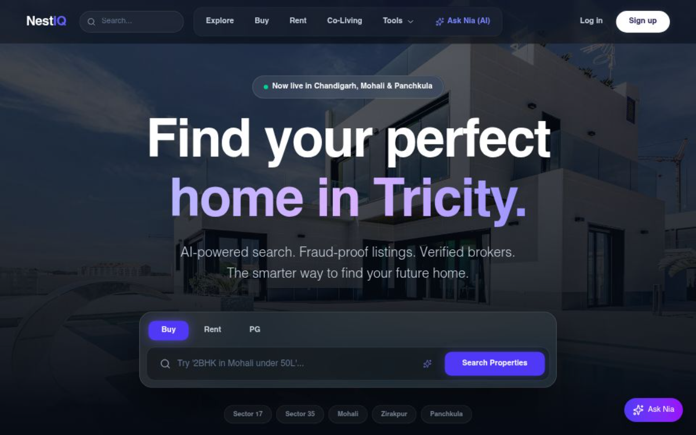

# NestIQ 🏠

**NestIQ** is a premium, AI-powered real estate platform specifically designed for the Tricity region (Chandigarh, Mohali, and Panchkula). It leverages cutting-edge technology to eliminate fraud, provide hyper-local intelligence, and streamline the entire property lifecycle—from search to tenancy.

🚀 **Live Demo**: [https://nest-iq-inky.vercel.app/](https://nest-iq-inky.vercel.app/)



---

## ✨ Key Features

- **🤖 Nia (AI Property Assistant)**: Describe your dream home in plain language (e.g., *"3BHK in Mohali under 60L with a garden"*) and our AI instantly finds the best matches.
- **🛡️ Trust Score & Fraud Protection**: Every listing undergoes automated verification and manual review to assign a transparency score, protecting you from ghost listings.
- **📊 Locality Intelligence**: Get real-time data on Air Quality Index (AQI), Walkability Scores, and proximity to schools, hospitals, and transit directly on the listing page.
- **📑 Digital Tenancy Hub**: Manage the entire rental lifecycle with digital lease agreements, automated rent payments via Razorpay, and integrated maintenance request tracking.
- **🔍 Advanced Search with Algolia**: Lightning-fast search with granular filters for Buy, Rent, and PG listings.
- **💬 Real-time Messaging**: Instant communication between buyers, owners, and verified brokers powered by Pusher.

---

## 🛠️ Technology Stack

| Layer | Technology |
|---|---|
| **Frontend** | [Next.js 16 (Canary)](https://nextjs.org/), [React 19](https://react.dev/), [Tailwind CSS 4](https://tailwindcss.com/) |
| **Styling/UI** | [Framer Motion](https://www.framer.com/motion/), [Lucide React](https://lucide.dev/), [Radix UI](https://www.radix-ui.com/) |
| **Backend** | Next.js Route Handlers (Serverless) |
| **Database** | [MongoDB](https://www.mongodb.com/) with [Mongoose](https://mongoosejs.com/) |
| **Authentication** | [NextAuth.js](https://next-auth.js.org/) |
| **AI/ML** | [Google Gemini 2.5 Flash](https://ai.google.dev/) |
| **Search** | [Algolia](https://www.algolia.com/) |
| **Payments** | [Razorpay](https://razorpay.com/) |
| **Media Storage** | [Cloudinary](https://cloudinary.com/) |
| **Real-time** | [Pusher](https://pusher.com/) |

---

## 🚀 Getting Started

### Prerequisites

- Node.js 18.x or higher
- MongoDB Atlas account or local instance
- API keys for Gemini, Algolia, Cloudinary, Razorpay, and Pusher

### Installation

1. **Clone the repository:**
   ```bash
   git clone https://github.com/shivxmsharma/NestIQ.git
   cd nestiq
   ```

2. **Install dependencies:**
   ```bash
   npm install
   ```

3. **Environment Setup:**
   Create a `.env.local` file in the root directory and add the following keys:
   ```env
   # Database
   MONGODB_URI=your_mongodb_uri

   # Authentication
   NEXTAUTH_URL=http://localhost:3000
   NEXTAUTH_SECRET=your_nextauth_secret
   GOOGLE_CLIENT_ID=your_google_id
   GOOGLE_CLIENT_SECRET=your_google_secret

   # AI & Search
   GEMINI_API_KEY=your_gemini_key
   ALGOLIA_APP_ID=your_algolia_id
   ALGOLIA_API_KEY=your_algolia_key

   # Payments & Storage
   RAZORPAY_KEY_ID=your_razorpay_id
   RAZORPAY_KEY_SECRET=your_razorpay_secret
   CLOUDINARY_CLOUD_NAME=your_cloud_name
   CLOUDINARY_API_KEY=your_api_key
   CLOUDINARY_API_SECRET=your_api_secret

   # Real-time
   PUSHER_APP_ID=your_pusher_id
   PUSHER_KEY=your_pusher_key
   PUSHER_SECRET=your_pusher_secret
   PUSHER_CLUSTER=your_pusher_cluster
   ```

4. **Seed the Database:**
   Populate your database with high-quality demo listings and users:
   ```bash
   npm run seed
   ```

5. **Sync Search Index:**
   Sync your properties with Algolia:
   ```bash
   npm run sync:algolia
   ```

6. **Run the development server:**
   ```bash
   npm run dev
   ```
   Open [http://localhost:3000](http://localhost:3000) to see the result.

---

## 📂 Project Structure

- `src/app/`: Next.js 16 App Router (Pages & API Routes)
- `src/components/`: Reusable React components (UI, Layout, AI, Property)
- `src/lib/`: Core logic, models (Mongoose), and utility functions
- `src/hooks/`: Custom React hooks
- `scripts/`: Maintenance and seeding scripts
- `public/`: Static assets

---

## ⚖️ License

Distributed under the MIT License. See `LICENSE` for more information.

---

## 🤝 Contact

**Project Lead**: Shivam Sharma - [@shivxmsharma](https://github.com/shivxmsharma)

Project Link: [https://github.com/shivxmsharma/NestIQ](https://github.com/shivxmsharma/NestIQ)
